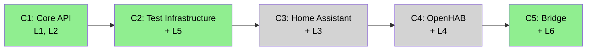
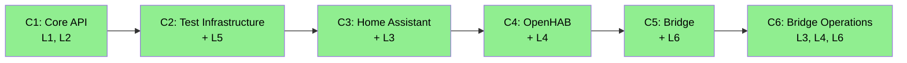

# ARC42STORIES.MD C6 Update — Implementation Plan

> **For agentic workers:** REQUIRED SUB-SKILL: Use superpowers:subagent-driven-development (recommended) or superpowers:executing-plans to implement this plan task-by-task. Steps use checkbox (`- [ ]`) syntax for tracking.

**Goal:** Update ARC42STORIES.MD to reflect the bridge operations milestone (#32, #33, #34) as Chapter 6, correct pre-existing errors (BridgeMessage variant count, flowchart colors, sequence denominators), and add four crosscutting concept subsections.

**Architecture:** Single-file documentation update to `ARC42STORIES.MD` at project root. All changes are text edits — no code, no tests. Verification is structural: section headings match, tables parse, mermaid diagrams render, no broken cross-references.

**Tech Stack:** Markdown, Mermaid diagrams

## Global Constraints

- Spec: `docs/superpowers/specs/2026-06-27-arc42stories-c6-update-design.md`
- Target file: `ARC42STORIES.MD` (project root)
- Issue: #36
- All edits must be precise string replacements — preserve surrounding context exactly
- Tables must maintain existing column alignment style
- Mermaid diagrams must follow existing syntax conventions in the file

---

### Task 1: §4 Solution Strategy — L6 Character + Sequencing Rationale

**Files:**
- Modify: `ARC42STORIES.MD` — §4 Layer Taxonomy table (L6 row, Character column) and Chapter Sequencing Rationale subsection

- [ ] **Step 1: Update L6 Character column**

In the §4 Layer Taxonomy table, replace L6 row's Character cell:

Old:
```
| L6 | Bridge | iot-bridge + iot-bridge-server | Two-sided tunnel: local agent (event relay, filter chain) + cloud-side BridgeDeviceProvider. |
```

New:
```
| L6 | Bridge | iot-bridge + iot-bridge-server | Two-sided tunnel: local agent (event relay, CDI-discovered filter chain) + cloud-side BridgeDeviceProvider. Docker deployment (multi-arch image, Compose). Conditional provider activation via @LookupIfProperty. BridgeAuditEvent CDI events for operational + compliance audit trails. |
```

- [ ] **Step 2: Add C6 sequencing rationale**

After the existing C4 entry in §4 Chapter Sequencing Rationale:
```
- C4 after C3: OpenHAB state cache coalescing and semantic model mapping are informed by HA experience (soft ordering)
- C5 after C3/C4: Bridge depends on iot-api + at least one working provider for integration testing (hard dependency)
```

Add:
```
- C6 after C5: Bridge Operations requires working bridge infrastructure (hard — Docker image builds from bridge module, audit fires from bridge-server endpoints)
```

- [ ] **Step 3: Verify and commit**

Run: `git -C <PROJECT> diff ARC42STORIES.MD` — verify only §4 changed.

```bash
git -C <PROJECT> add ARC42STORIES.MD
git -C <PROJECT> commit -m "docs: ARC42STORIES §4 — L6 character + C6 sequencing — #36"
```

---

### Task 2: §6 Runtime View — Two New Scenarios

**Files:**
- Modify: `ARC42STORIES.MD` — §6 Runtime View, after Scenario 5

- [ ] **Step 1: Add Scenario 6 after Scenario 5**

After the closing ` ``` ` of Scenario 5's sequence diagram, add:

```markdown
### Scenario 6 — Provider Auto-Discovery (mDNS/SSDP)

Provider is enabled but no URL is configured. On first `discover()` or `status()` call, lazy init triggers mDNS/SSDP discovery to resolve the platform URL, then creates the REST client programmatically.

` ```mermaid
sequenceDiagram
  participant App as CdiDeviceRegistry
  participant Prov as HomeAssistantProvider
  participant Init as getRestClient() [lazy init]
  participant Cfg as HomeAssistantConfig
  participant DNS as HomeAssistantDiscovery (JmDNS)
  participant RCB as RestClientBuilder

  App->>Prov: discover()
  Prov->>Init: getRestClient() [first call]
  Init->>Cfg: url() → Optional.empty()
  Init->>DNS: resolve(timeoutSeconds)
  DNS->>DNS: JmDNS.create() → listen for _home-assistant._tcp.local.
  DNS-->>Init: "http://192.168.1.50:8123"
  Init->>Cfg: token() → Optional.of("ha-token")
  Init->>RCB: newBuilder().baseUri(resolvedUrl).register(BearerAuthFilter)
  RCB-->>Init: HomeAssistantRestClient
  Init-->>Prov: restClient
  Prov->>Init: restClient.getStates()
  Note over Prov: Subsequent calls reuse the cached restClient
` ```

OpenHAB follows the same pattern with `ensureSseConnected()` — tries mDNS first (`_openhab-server._tcp.local.`), falls back to SSDP (raw UDP multicast M-SEARCH on `239.255.255.250:1900`). Both providers have empty `@PostConstruct` methods — the implementation spec prescribed eager init, but the implementation chose lazy init to avoid startup races with test servers.
```

Note: Remove the space before each ` ```mermaid ` and ` ``` ` — they are escaped here to avoid nesting issues.

- [ ] **Step 2: Add Scenario 7 after Scenario 6**

```markdown
### Scenario 7 — Bridge Audit Event Flow

Bridge server fires `BridgeAuditEvent` for every protocol message. Multiple CDI observers process independently — operational logging always on, compliance ledger opt-in via classpath.

` ```mermaid
sequenceDiagram
  participant Agent as Bridge Agent
  participant WS as BridgeWebSocketEndpoint
  participant CDI as CDI Event Bus
  participant Log as LoggingBridgeAuditObserver
  participant Future as [Future] ComplianceLedgerObserver

  Agent->>WS: WebSocket message (STATE_CHANGE)
  WS->>WS: deserialize → BridgeMessage.StateChange
  WS->>CDI: Event<BridgeAuditEvent>.fireAsync(STATE_CHANGE, deviceId, message)
  CDI->>Log: @ObservesAsync BridgeAuditEvent → structured JSON log
  CDI->>Future: @ObservesAsync BridgeAuditEvent → LedgerEntry (opt-in)
  WS->>CDI: Event<StateChangeEvent>.fireAsync(after namespace)
  Note over WS: Audit fires BEFORE StateChangeEvent dispatch
  Note over WS: REPLAYED_STATE_CHANGE fires audit but NOT StateChangeEvent
` ```

Firing points: `@OnOpen` (AGENT_CONNECTED), `@OnClose` (AGENT_DISCONNECTED), `@OnTextMessage` (STATE_CHANGE, REPLAYED_STATE_CHANGE, STATE_SNAPSHOT, PROVIDER_STATUS_CHANGE, COMMAND_RESPONSE), `BridgeDeviceProvider.dispatch()` (COMMAND_SENT). No HEARTBEAT audit — protocol noise.
```

Note: Remove the space before each ` ```mermaid ` and ` ``` `.

- [ ] **Step 3: Verify and commit**

Run: `git -C <PROJECT> diff ARC42STORIES.MD` — verify only §6 changed, two new scenarios added.

```bash
git -C <PROJECT> add ARC42STORIES.MD
git -C <PROJECT> commit -m "docs: ARC42STORIES §6 — scenarios 6 (auto-discovery) and 7 (audit) — #36"
```

---

### Task 3: §7 Deployment View — Mode 3 Rewrite + Docker + Provider Activation

**Files:**
- Modify: `ARC42STORIES.MD` — §7 Deployment View

- [ ] **Step 1: Rewrite Mode 3 (Hybrid)**

Replace the entire Mode 3 section. The existing content starts with `### Mode 3 — Hybrid` and ends before `### Build Commands`.

Old (delete everything between `### Mode 3 — Hybrid` heading and `### Build Commands`):
```markdown
### Mode 3 — Hybrid

Bridge runs Drools locally for latency-sensitive reactions. StateChangeEvents also forwarded to cloud for orchestration, optimization, HITL, ledger, and memory.

` ```properties
casehub.iot.bridge.cloud-endpoint=wss://casehub.io/bridge
casehub.iot.bridge.tenant-id=<tenancy-id>
casehub.iot.bridge.token=<bridge-auth-token>
casehub.iot.bridge.local-automations=security-alert,presence-lights
casehub.iot.bridge.cloud-automations=energy-optimization,morning-routine
` ```
```

New:
```markdown
### Mode 3 — Hybrid

Latency-sensitive observers (Drools rules, YAML triggers) are added to the bridge deployment as classpath dependencies — standard Quarkus CDI extension. They fire locally via `@ObservesAsync StateChangeEvent` on the bridge's own CDI container. The bridge still forwards all events to cloud for orchestration, HITL, ledger, and memory. No bridge-specific configuration — "hybrid" is a deployment topology choice, not a bridge mode.

` ```
LOCAL:  bridge + iot-ha + life-triggers.jar  →  cloud: bridge-server + casehub-life
` ```
```

Note: Remove the space before each ` ``` `.

- [ ] **Step 2: Add Docker Deployment + Provider Activation after Mode 3**

After Mode 3 and before `### Build Commands`, insert:

```markdown
### Docker Deployment

Image: `ghcr.io/casehubio/iot-bridge` — eclipse-temurin:21-jre-alpine, Quarkus fast-jar layout, non-root user (UID 1001). Multi-arch: ARM64 (Raspberry Pi 4/5) + x86_64 via `docker buildx` in GitHub Actions.

Docker Compose (`bridge/docker-compose.yml`): single service, `network_mode: host` (required for mDNS/SSDP multicast discovery), named volume for persistent event store (`data/bridge-events/`), health check via `/q/health/ready`. Both HA and OpenHAB provider modules are on the classpath — each activates independently.

Deployment guide: `bridge/DEPLOYMENT.md` — prerequisites, configuration reference, deploy/verify/update workflow, troubleshooting.

### Provider Activation

Both provider modules ship in a single Docker image. Activation is controlled by `@LookupIfProperty`:

` ```java
@ApplicationScoped
@LookupIfProperty(name = "casehub.iot.homeassistant.enabled", stringValue = "true")
public class HomeAssistantProvider implements DeviceProvider { ... }
` ```

When `enabled` is absent or not equal to `"true"`, the provider bean is not discoverable via `Instance<DeviceProvider>`. `CdiDeviceRegistry` and `BridgeCommandDispatcher` simply don't see it. No `@PostConstruct` runs. No REST client creation. No guard code needed — the provider doesn't exist.

All provider config properties are `Optional<String>` — prevents SmallRye startup validation failure when a provider is disabled but its config properties are absent.
```

Note: Remove the space before each ` ```java ` and ` ``` `.

- [ ] **Step 3: Verify and commit**

Run: `git -C <PROJECT> diff ARC42STORIES.MD` — verify §7 Mode 3 rewritten, Docker and Provider Activation added before Build Commands.

```bash
git -C <PROJECT> add ARC42STORIES.MD
git -C <PROJECT> commit -m "docs: ARC42STORIES §7 — Mode 3 rewrite, Docker deployment, provider activation — #36"
```

---

### Task 4: §8 Crosscutting Concepts — Four New Subsections

**Files:**
- Modify: `ARC42STORIES.MD` — §8 Crosscutting Concepts, after existing Anti-patterns subsection

- [ ] **Step 1: Add four subsections after Anti-patterns**

After the last anti-pattern entry ("Command dispatch to disconnected provider") and before `## §9.1 Journey Overview`, insert:

```markdown
### Provider Activation Pattern

`@LookupIfProperty(name = "casehub.iot.<provider>.enabled", stringValue = "true")` makes provider beans conditionally visible to CDI. When `enabled` is absent or not equal to `"true"`, the bean is not instantiated — no lazy init triggered, no REST client creation, no guard code. All provider consumption goes through `@Any Instance<DeviceProvider>`, which only sees enabled providers.

All provider config properties (`url`, `token`, auth nested objects) are `Optional<String>`. SmallRye Config validates `@ConfigMapping` properties at startup regardless of bean lifecycle — required properties on a disabled provider crash the app before any `@PostConstruct` or `@LookupIfProperty` evaluation occurs.

### TenancyId Consolidation

Single `casehub.iot.tenancy-id` root property (env var `CASEHUB_IOT_TENANCY_ID`) replacing three per-module `tenancyId()` properties on `BridgeAgentConfig`, `HomeAssistantConfig`, `OpenHabConfig`. Every consumer injects via `@ConfigProperty(name = "casehub.iot.tenancy-id")` directly. One property, zero divergence risk.

### Programmatic REST Client Creation

`RestClientBuilder` replacing `@RegisterRestClient` property expressions for both HA and OpenHAB REST clients. Root cause: SmallRye resolves `${casehub.iot.homeassistant.url}` at config startup — before CDI starts, before `@LookupIfProperty` evaluates. Two failure modes:

1. **Disabled provider with absent URL:** `Optional<String>` on the `@ConfigMapping` doesn't help — the property expression in `application.properties` is resolved by SmallRye directly. `NoSuchElementException` crashes the app.
2. **Auto-discovery produces URL after REST client binding:** `@RestClient` base URL is immutable after config time. Discovery in lazy init resolves the URL too late.

Fix: remove property expressions from `application.properties`, create REST clients programmatically in lazy init via `RestClientBuilder.newBuilder().baseUri(resolvedUrl).register(authFilter).build(...)`.

**Gotcha:** `ClientHeadersFactory` (MicroProfile REST Client extension interface) is silently ignored by `RestClientBuilder.register()` — it is not a JAX-RS provider. No error, no auth header, 401 on every request. Auth must use `ClientRequestFilter` (a plain JAX-RS provider) instead. `OpenHabAuthHeadersFactory` was deleted and replaced by `OpenHabAuthFilter implements ClientRequestFilter`.

### Bridge Audit Trail (Dual-Trail Pattern)

`BridgeAuditEvent` CDI event type in `api/bridge/`. `BridgeAuditEventType` enum with 8 event types (no HEARTBEAT — protocol noise, not auditable). Operational observer (`LoggingBridgeAuditObserver`) always active when bridge-server is on the classpath — structured JSON logging queryable via log aggregation.

Compliance observer is opt-in via classpath: a future `casehub-iot-bridge-ledger` module would contain an `@ObservesAsync BridgeAuditEvent` handler writing `BridgeLedgerEntry extends LedgerEntry`. Multiple CDI event observers coexist independently — the original design considered a `BridgeAuditStore` SPI, but CDI selects one SPI implementation (highest priority), while dual-trail requires BOTH operational logging AND compliance ledger active simultaneously.

Structured query and retrieval of audit history (beyond log aggregation) is deferred to #35 (`BridgeAuditStore` SPI).
```

- [ ] **Step 2: Verify and commit**

Run: `git -C <PROJECT> diff ARC42STORIES.MD` — verify four new subsections in §8, placed before §9.1.

```bash
git -C <PROJECT> add ARC42STORIES.MD
git -C <PROJECT> commit -m "docs: ARC42STORIES §8 — provider activation, tenancyId, REST clients, audit trail — #36"
```

---

### Task 5: §9.1 + §9.2 — Journey Overview, Chapter Index, Matrix, Denominators

**Files:**
- Modify: `ARC42STORIES.MD` — §9.1 Journey Overview (table + flowchart), §9.2 Chapter Index (new row + matrix + sequencing + denominators)

- [ ] **Step 1: Update §9.1 Journey Overview table**

Replace `| 5 | Complete |` with `| 6 | Complete |` in the journey table row.

- [ ] **Step 2: Fix §9.1 flowchart — add C6, fix C3/C4 colors**

Replace the entire flowchart block:

Old:


New:


- [ ] **Step 3: Add C6 row to §9.2 Chapter Index table**

After the C5 row:
```
| 5 | Bridge | IoT Device Abstraction | + L6 | High | ✅ |
```

Add:
```
| 6 | Bridge Operations | IoT Device Abstraction | L3, L4, L6, crosscutting | Low, Low, High | ✅ |
```

- [ ] **Step 4: Add C6 column to Layer x Chapter Matrix**

Add ` | C6 |` header and values to the existing matrix. Each row gets a new cell:

| Layer | C6 value |
|---|---|
| L1 Device Type System | — |
| L2 SPI & Registry | — |
| L3 Home Assistant | Low |
| L4 OpenHAB | Low |
| L5 Test Harness | — |
| L6 Bridge | High |

- [ ] **Step 5: Add C6 sequencing rationale to §9.2**

After the existing C5 entry:
```
- C5 after C3/C4: Bridge requires at least one working provider for integration testing (hard — bridge forwards events from real providers)
```

Add:
```
- C6 after C5: Bridge Operations requires working bridge infrastructure (hard — Docker image builds from bridge module, audit fires from bridge-server endpoints)
```

- [ ] **Step 6: Update all chapter sequence denominators**

In §9.3, replace all five occurrences:
- `1 of 5` → `1 of 6`
- `2 of 5` → `2 of 6`
- `3 of 5` → `3 of 6`
- `4 of 5` → `4 of 6`
- `5 of 5` → `5 of 6`

- [ ] **Step 7: Verify and commit**

Run: `git -C <PROJECT> diff ARC42STORIES.MD` — verify §9.1 table, flowchart, §9.2 index, matrix, sequencing, denominators all updated.

```bash
git -C <PROJECT> add ARC42STORIES.MD
git -C <PROJECT> commit -m "docs: ARC42STORIES §9.1/§9.2 — C6 journey, index, matrix, denominators — #36"
```

---

### Task 6: §9.3 Chapter 6 Entry

**Files:**
- Modify: `ARC42STORIES.MD` — §9.3 Chapter Entries, after Chapter 5

- [ ] **Step 1: Add Chapter 6 entry after Chapter 5**

After the C5 layer impact table and its `---` separator, insert:

```markdown
### Chapter 6 — Bridge Operations

**Journey:** IoT Device Abstraction | **Sequence:** 6 of 6 | **Status:** ✅
**Delivered:** 2026-06-26 | **Issues:** #32, #33, #34

**What this delivers**

Production deployment artifact (Docker Compose + multi-arch image for ARM64 and x86_64), self-configuring providers (mDNS/SSDP auto-discovery when URL is not configured), and observable bridge operations (BridgeAuditEvent CDI events with dual-trail audit pattern). Cross-cutting: tenancyId consolidated to single `casehub.iot.tenancy-id` root property, REST clients migrated from `@RegisterRestClient` to programmatic `RestClientBuilder`, all provider config properties made `Optional<String>` for safe disabled-provider startup.

**Accountability gaps closed**
- No production deployment artifact → Docker Compose + Dockerfile.jvm + multi-arch CI build + DEPLOYMENT.md (L6)
- No self-configuration → mDNS/SSDP auto-discovery, URL optional, lazy init on first use (L3, L4)
- No audit trail → BridgeAuditEvent CDI events + LoggingBridgeAuditObserver with structured JSON (L6)
- Config divergence risk (3 tenancyId properties) → single casehub.iot.tenancy-id (crosscutting)
- Disabled provider crashes app (SmallRye validates required props at startup) → Optional config + @LookupIfProperty (L3, L4)
- REST client URL baked at config time (incompatible with discovery) → programmatic RestClientBuilder (L3, L4)

**Layer Impact**

| Layer | Delta |
|---|---|
| L3 Home Assistant | Low — config properties Optional, @LookupIfProperty activation, mDNS discovery, programmatic RestClientBuilder, tenancyId removed from HomeAssistantConfig |
| L4 OpenHAB | Low — same pattern as L3, plus SSDP fallback for discovery |
| L6 Bridge | High — Docker deployment (Dockerfile.jvm, docker-compose.yml, DEPLOYMENT.md, multi-arch CI), BridgeAuditEvent + BridgeAuditEventType in api/bridge/, LoggingBridgeAuditObserver in bridge-server, @LookupIfProperty provider activation, tenancyId consolidation |
```

- [ ] **Step 2: Verify and commit**

Run: `git -C <PROJECT> diff ARC42STORIES.MD` — verify C6 entry added after C5 in §9.3.

```bash
git -C <PROJECT> add ARC42STORIES.MD
git -C <PROJECT> commit -m "docs: ARC42STORIES §9.3 — Chapter 6 Bridge Operations entry — #36"
```

---

### Task 7: §9.4 Layer Entry Updates (Bridge, HA, OH)

**Files:**
- Modify: `ARC42STORIES.MD` — §9.4 Bridge, Home Assistant, and OpenHAB layer entries

- [ ] **Step 1: Update Bridge layer entry — issues and participates**

Change:
```
**Participates in chapters:** C5
```
To:
```
**Participates in chapters:** C5, C6
```

Change:
```
**Issues:** casehubio/iot#5
```
To:
```
**Issues:** casehubio/iot#5, casehubio/iot#32, casehubio/iot#33, casehubio/iot#34
```

- [ ] **Step 2: Correct BridgeMessage variant count**

In Bridge layer "What it adds" section, replace:
```
- **Sealed BridgeMessage** — 6 record variants (StateChange, StateSnapshot, ProviderStatusChange, Command, CommandResponse, Heartbeat) with exhaustive pattern matching. Wire format names: STATE_CHANGE, STATE_SNAPSHOT, PROVIDER_STATUS, COMMAND, COMMAND_RESULT, HEARTBEAT.
```

With:
```
- **Sealed BridgeMessage** — 7 record variants (StateChange, StateSnapshot, ProviderStatusChange, Command, CommandResponse, Heartbeat, ReplayedStateChange) with exhaustive pattern matching. Wire format names: STATE_CHANGE, STATE_SNAPSHOT, PROVIDER_STATUS, COMMAND, COMMAND_RESULT, HEARTBEAT, REPLAYED_STATE_CHANGE.
```

- [ ] **Step 3: Add C6 content to Bridge "What it adds"**

After the existing Bridge layer bullet points (ending with "Snapshot-only reconnection..."), add:

```markdown
- **Docker deployment (C6)** — `Dockerfile.jvm` (Temurin 21-jre-alpine, fast-jar, non-root UID 1001), `docker-compose.yml` (host network, event store volume, health check), `.env.example`, multi-arch CI build (ARM64 + x86_64). Deployment guide: `bridge/DEPLOYMENT.md`.
- **BridgeAuditEvent CDI events (C6)** — `BridgeAuditEvent` record + `BridgeAuditEventType` enum (8 types, no HEARTBEAT) in `api/bridge/`. `LoggingBridgeAuditObserver` in bridge-server produces structured JSON. Dual-trail: operational logging always on, compliance ledger opt-in via classpath.
- **Provider activation (C6)** — `@LookupIfProperty` on both providers. Single Docker image, each provider enabled independently. All config properties `Optional<String>`.
- **TenancyId consolidation (C6)** — single `casehub.iot.tenancy-id` root property replacing three per-module `tenancyId()` properties.
```

- [ ] **Step 4: Add key files for C6 to Bridge layer**

In the Bridge layer "Key files (delivered)" section, add:

```markdown
- `api/src/main/java/io/casehub/iot/api/bridge/BridgeAuditEvent.java` — audit event record: tenancyId, receivedAt, eventType, correlationId, deviceId, message
- `api/src/main/java/io/casehub/iot/api/bridge/BridgeAuditEventType.java` — enum: 8 audit event types (no HEARTBEAT)
- `bridge-server/src/main/java/io/casehub/iot/bridge/server/audit/LoggingBridgeAuditObserver.java` — @ObservesAsync BridgeAuditEvent → structured JSON log
- `bridge/src/main/docker/Dockerfile.jvm` — Temurin 21-jre-alpine, fast-jar, non-root
- `bridge/docker-compose.yml` — single service, host network, event store volume, health check
- `bridge/DEPLOYMENT.md` — deployment guide: prerequisites, config reference, troubleshooting
```

- [ ] **Step 5: Add architectural decision to Bridge layer**

In the Bridge layer "Architectural decisions" section, add:

```markdown
- **Why CDI events for bridge audit, not SPI (C6):** The dual-trail audit pattern requires both operational logging AND compliance ledger active simultaneously. CDI selects one SPI implementation (highest priority), but CDI events support N independent `@ObservesAsync` observers. Each observer fires independently — adding compliance is classpath-only (new module with observer bean).
```

- [ ] **Step 6: Add gotcha to Bridge layer**

In the Bridge layer "Gotchas" section, add:

```markdown
- SmallRye Config validates ALL `@ConfigMapping` properties at startup regardless of bean lifecycle. A disabled provider (bean never instantiated via `@LookupIfProperty`) with required properties (`String url()`) crashes the app with `NoSuchElementException` before any CDI bean is created. Fix: all provider config properties must be `Optional<String>`, validated programmatically in lazy init when `enabled=true`.
```

- [ ] **Step 7: Update HA layer entry**

Change HA layer:
```
**Participates in chapters:** C3, C5
```
To:
```
**Participates in chapters:** C3, C5, C6
```

Change:
```
**Issues:** casehubio/iot#3
```
To:
```
**Issues:** casehubio/iot#3, casehubio/iot#33
```

Add to HA "Key files" section:
```markdown
- `homeassistant/src/main/java/io/casehub/iot/homeassistant/HomeAssistantDiscovery.java` — mDNS discovery via JmDNS (_home-assistant._tcp.local.)
```

Add to HA "Gotchas" section (replace 🔲 if present):
```markdown
- `@PostConstruct` discovery was planned (per bridge-ops spec) but implementation uses lazy init — double-checked locking in `getRestClient()`. Avoids startup races with test servers and defers network I/O until the provider is actually used by `CdiDeviceRegistry.discover()`.
```

- [ ] **Step 8: Update OH layer entry**

Change OH layer:
```
**Participates in chapters:** C4, C5
```
To:
```
**Participates in chapters:** C4, C5, C6
```

Change:
```
**Issues:** casehubio/iot#4, casehubio/iot#11, casehubio/iot#13
```
To:
```
**Issues:** casehubio/iot#4, casehubio/iot#11, casehubio/iot#13, casehubio/iot#33
```

Add to OH "Key files" section:
```markdown
- `openhab/src/main/java/io/casehub/iot/openhab/OpenHabDiscovery.java` — mDNS (_openhab-server._tcp.local.) + SSDP fallback (raw UDP multicast)
```

Add to OH "Gotchas" section (replace 🔲 if present):
```markdown
- Same lazy init pattern as HA — `ensureSseConnected()` with double-checked locking replaces planned `@PostConstruct` discovery. Also creates REST client and SSE client programmatically on first use.
```

- [ ] **Step 9: Verify and commit**

Run: `git -C <PROJECT> diff ARC42STORIES.MD` — verify Bridge, HA, OH layer entries all updated.

```bash
git -C <PROJECT> add ARC42STORIES.MD
git -C <PROJECT> commit -m "docs: ARC42STORIES §9.4 — Bridge/HA/OH layer entries for C6 — #36"
```

---

### Task 8: §12 Risks + §13 Glossary + Status Line

**Files:**
- Modify: `ARC42STORIES.MD` — §12 Risks, §13 Glossary, status line

- [ ] **Step 1: Update §12 Bridge security risk**

In §12, find the "Bridge security" row and update Status from `Open` to `Mitigated`:

Old:
```
| Bridge security | WebSocket to cloud carries device state — interception risk | Open | TLS mandatory; bridge-auth-token per tenant; bridge does not store HA/OH credentials |
```

New:
```
| Bridge security | WebSocket to cloud carries device state — interception risk | Mitigated | TLS mandatory; bridge-auth-token per tenant; bridge does not store HA/OH credentials. Documented in DEPLOYMENT.md with token rotation guidance. |
```

- [ ] **Step 2: Add glossary terms**

After the existing last glossary entry (`BridgeDeviceProvider`), add:

```markdown
| **BridgeAuditEvent** | Java record fired as a CDI async event for all bridge protocol messages. Carries tenancyId, receivedAt, eventType, optional correlationId/deviceId/message. |
| **BridgeAuditEventType** | Enum classifying audit events: STATE_CHANGE, REPLAYED_STATE_CHANGE, STATE_SNAPSHOT, PROVIDER_STATUS_CHANGE, COMMAND_SENT, COMMAND_RESPONSE, AGENT_CONNECTED, AGENT_DISCONNECTED. No HEARTBEAT. |
| **@LookupIfProperty** | Quarkus CDI mechanism for conditional bean activation. Provider not discoverable via `Instance<>` when property is absent or not equal to `"true"`. |
| **Dual-trail audit pattern** | Operational logging and compliance ledger as independent CDI event observers. Both fire for every BridgeAuditEvent. Neither blocks the other. |
```

- [ ] **Step 3: Update status line**

At the top of the file, change:
```
**Status:** C1–C5 complete.
```
To:
```
**Status:** C1–C6 complete.
```

- [ ] **Step 4: Update Self-Assessment**

In "Arc42Stories Self-Assessment" → "Completeness", update:
```
- **All 6 layers:** Scoped with planned key files...
- **All 5 chapters:** Scoped with layer impact matrices...
```
To:
```
- **All 6 layers:** Scoped with key files...
- **All 6 chapters:** Scoped with layer impact matrices...
```

And fix pre-existing count error (§10 has ADR-0001 through ADR-0004 = four, not three):
```
- **§10:** Three cross-cutting ADRs. Layer-specific decisions are inline in §9.4.
```
To:
```
- **§10:** Four cross-cutting ADRs. Layer-specific decisions are inline in §9.4.
```

- [ ] **Step 5: Verify and commit**

Run: `git -C <PROJECT> diff ARC42STORIES.MD` — verify §12, §13, status line, self-assessment all updated.

```bash
git -C <PROJECT> add ARC42STORIES.MD
git -C <PROJECT> commit -m "docs: ARC42STORIES §12/§13 — risks, glossary, status update — #36"
```
